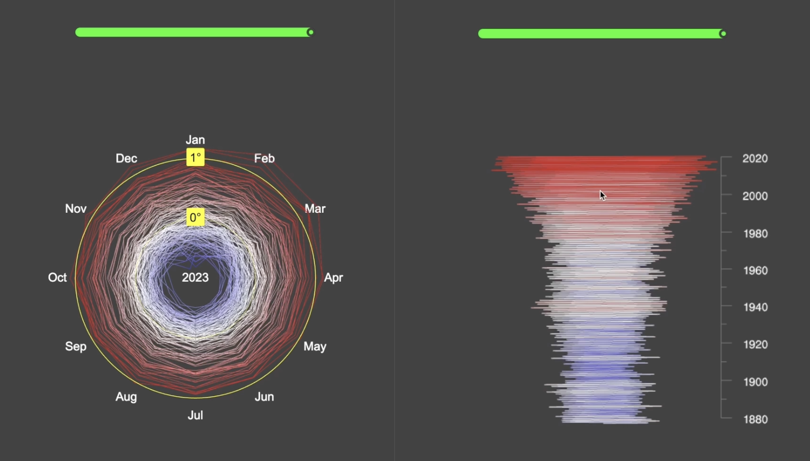

# Warming Stripes visualisation

There are 3 implementations of Global-mean monthly temperature data.

- canvas 2d
- three.js
- react-three-fiber

The actual data comes from NASA datasets, here is the [source](https://data.giss.nasa.gov/gistemp/tabledata_v4/GLB.Ts+dSST.csv)

There are 2 variants of visualisation: upfront (2d) and from the side (3d)

## Common dependency

In order to run all provided implementations you will need `parcel` installed globaly.
